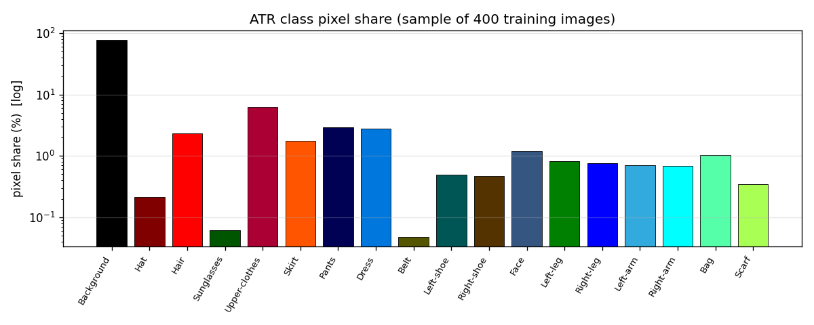
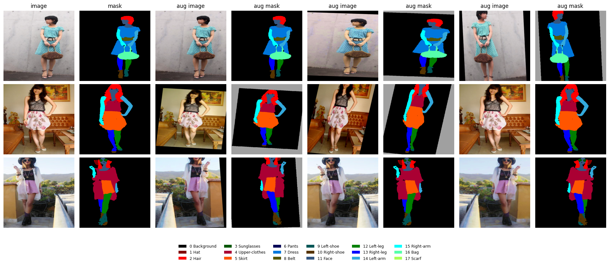
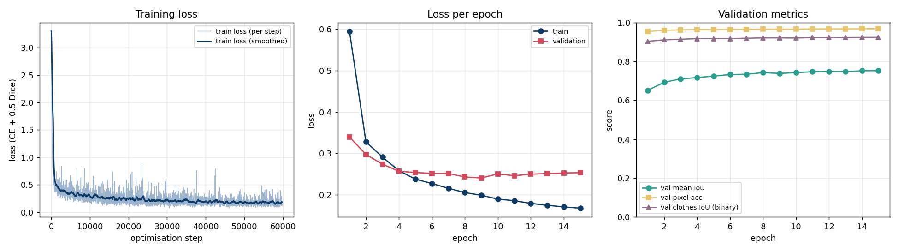
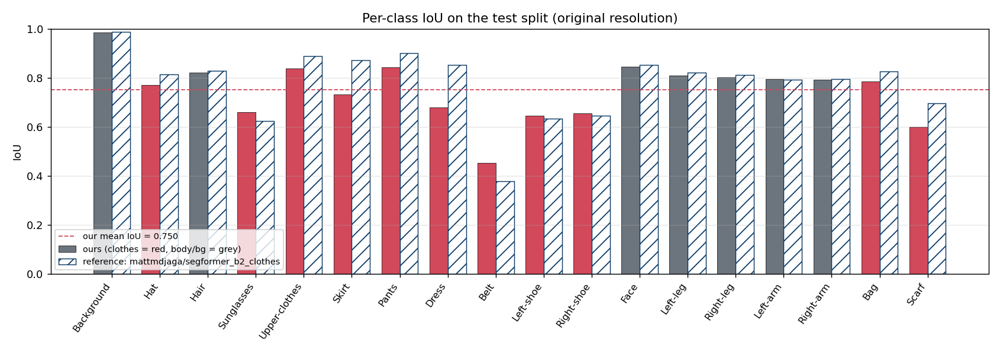
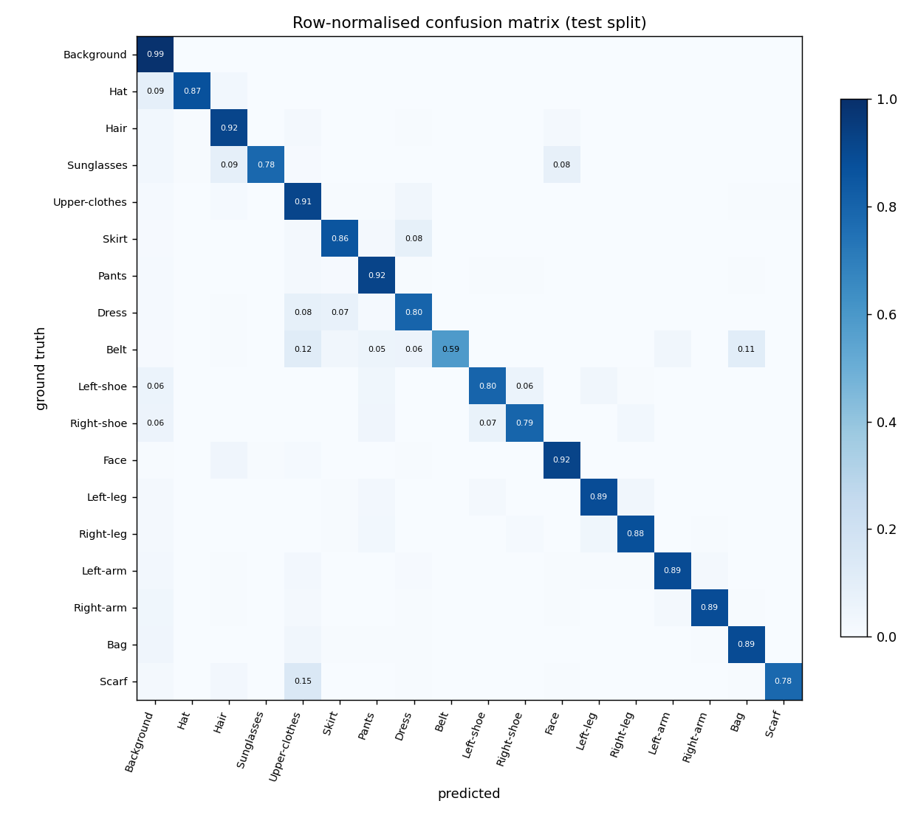
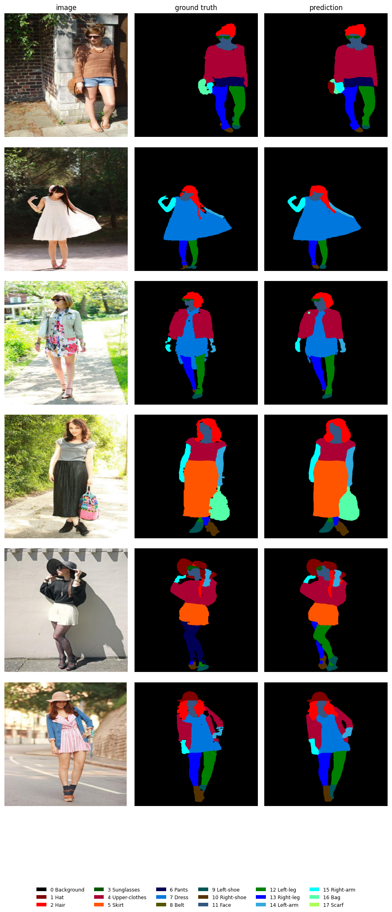
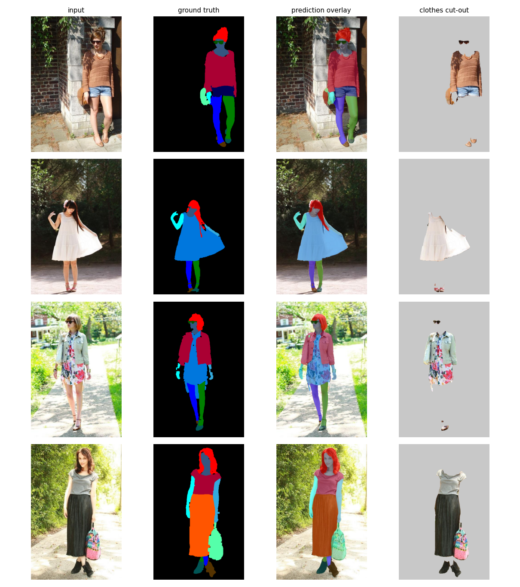

# Clothes Segmentation on ATR - Technical Report

*Task code CVCY002 - Computer Vision Engineer assignment*

## 1. Objective and headline result

Goal: segment the clothes worn by a person in a photo, pixel by pixel, as the core component of a
virtual fitting room. We fine-tune **SegFormer-B2** on the **ATR human-parsing dataset** (18 classes:
background, 6 body-part classes and 11 clothing / accessory classes).

**Headline test-set numbers (original image resolution, 885 images):**

| metric | ours (single pass) | ours + flip TTA | public reference model |
|---|---|---|---|
| mean IoU (18 classes) | 75.0% | 75.5% | 77.8% |
| mean IoU without background | 73.6% | 74.2% | 76.6% |
| pixel accuracy | 96.7% | 96.8% | 97.6% |
| mean class accuracy | 85.4% | 85.8% | 86.6% |
| mean Dice / F1 | 85.2% | 85.5% | 86.8% |
| clothes-vs-rest IoU (binary) | 92.4% | 92.6% | 93.2% |
| clothes-vs-rest Dice (binary) | 96.0% | 96.1% | 96.5% |
| test loss (CE + 0.5 Dice) | 0.2490 | 0.2340 | 0.2374 |
| inference speed (img/s, batch) | 52.9 | 12.5 | 53.6 |

The reference column is `mattmdjaga/segformer_b2_clothes`, the public SegFormer-B2 fine-tuned on ATR, scored with **exactly the same protocol** on our test split. Its training set most likely included our test images (the public model saw the whole ATR set), so its numbers are an optimistic upper reference rather than a fair competitor.

Mean IoU over the 11 clothing classes alone is **0.696**. The binary clothes-vs-rest IoU of
**0.924** is the number that matters most for "cut the clothes out of the photo":
92.4% overlap between predicted and true clothing pixels.

**Performance target.** The assignment requires a minimum performance without fixing a number, so we set the bar at **binary clothes-vs-rest IoU >= 0.90** and **mean IoU >= 0.70** on the held-out test split (what published SegFormer-B2 fine-tunes on ATR reach without test leakage). This run scores 0.924 and 0.750, so the target is **met**.

**Flip test-time augmentation (`--tta`).** Averaging the prediction on the image and on its mirror (left/right classes swapped back) needs no retraining and changes mean IoU by **+0.5 points** (binary clothes IoU +0.2); throughput drops from 52.9 to 12.5 img/s because of the second pass. The single-pass numbers remain the headline; the TTA column shows what the same checkpoint delivers when latency is not critical.

## 2. Dataset choice and reason

**Dataset:** `mattmdjaga/human_parsing_dataset` - the ATR (*Active Template Regression*) human parsing set as re-published on the
Hugging Face Hub, 17706 images with pixel-accurate 18-class masks.

Why ATR:

* **Right granularity.** It separates clothing *types* (upper-clothes, dress, skirt, pants, shoes, hat, scarf, belt, bag,
  sunglasses) instead of a single "clothes" blob, so the same model can power garment-specific try-on
  while a binary clothes mask is a trivial union of classes.
* **People-centred imagery.** Full-body fashion / street photos of a single person - the exact input a
  virtual fitting room receives.
* **Size vs. cost.** ~17.7k images is enough to fine-tune a modern transformer to a strong result in a few
  hours on a single consumer GPU (this run: an 8 GB laptop GPU), yet small enough (~0.8 GB) to download and
  cache locally.
* **Clean tooling.** Single parquet dataset, loads with one `datasets.load_dataset` call, no manual
  download scripts or licences to negotiate (alternatives such as LIP, CIHP, DeepFashion2 or iMaterialist
  need registration, are 5-25 GB, or label garments at instance level which the task does not need).

The split used here is **15,936 train / 885 validation / 885 test** images (seed 42). Images are portrait photos of roughly 400x606 px (width 125-957, height 527-1300). Class imbalance is severe: background covers 77.2% of all pixels while the five rarest classes (Belt 0.05%, Sunglasses 0.06%, Hat 0.21%, Scarf 0.35%, Right-shoe 0.47%) together cover less than 1.1%.



### Preprocessing and augmentation

* Images are resized to **512x512** and normalised with ImageNet mean / std
  (what every SegFormer checkpoint expects). Masks use nearest-neighbour resizing so labels stay integers.
* **Horizontal flip (p = 0.5) with left/right label swap.** ATR distinguishes left and right shoe / leg / arm.
  A naive flip would teach the model the wrong side; we swap label pairs (9,10), (12,13), (14,15) after mirroring.
* **Random affine** (scale 0.75-1.25, shift up to 5 %, rotation up to 12 deg, p = 0.7). Pixels created by the
  transform are labelled `255` and ignored by the loss and the metrics.
* **Photometric jitter:** brightness / contrast (p = 0.5), hue / saturation (p = 0.4), slight Gaussian blur (p = 0.1)
  to simulate different cameras and lighting.
* Validation / test: resize + normalise only. Test metrics are computed after up-sampling the logits to the
  **original** mask resolution, so they are not inflated by evaluating on down-sampled labels.



## 3. Model architecture

**SegFormer-B2** (Xie et al., NeurIPS 2021), 27.4 M parameters, initialised from
`nvidia/segformer-b2-finetuned-ade-512-512` with the classifier replaced by an 18-way ATR head.

* **Encoder - Mix Transformer (MiT-B2).** Four stages produce features at strides 4, 8, 16 and 32
  (64 / 128 / 320 / 512 channels). Overlapping patch embeddings keep local continuity, *efficient
  self-attention* reduces the key/value sequence length so 512x512 inputs are affordable, and the Mix-FFN
  (3x3 depth-wise conv inside the MLP) provides positional information without positional encodings - this is
  why SegFormer generalises across input resolutions.
* **Decoder - all-MLP head.** Each of the four feature maps is projected to 768 channels with a linear layer,
  up-sampled to stride 4, concatenated and fused by one more linear layer; a 1x1 conv predicts the 18 logits
  at 1/4 resolution which we bilinearly up-sample to the label size.
* **Why SegFormer for clothes?** Garments are large, deformable regions whose class depends on global
  context (a "dress" versus "upper-clothes + skirt" needs the whole body). Transformer attention gives that
  global receptive field at every layer, while the hierarchical design still captures thin structures such as
  belts and straps. B2 is the sweet spot between B0 (fast but ~5 mIoU points worse on ADE20K) and B5
  (3x slower, marginal gain on a 17k-image dataset).
* **Transfer learning.** The encoder has seen ImageNet-1k and ADE20K (150 scene classes incl. *person*),
  so we only need to adapt, not learn from scratch - a few epochs suffice.

Alternatives considered:

* **U-Net / DeepLab (CNN).** Strong on local texture, but the garment class depends on whole-body context
  (is this a dress, or a top and a skirt?). Attention gives that context at every layer; CNNs only reach it
  in the deepest, coarsest stage.
* **Mask2Former / SAM.** More accurate on some benchmarks but 3-10x heavier, slower to fine-tune, and SAM has
  no class vocabulary (it proposes masks, it does not name garments). SegFormer-B2 is the accuracy / cost /
  simplicity sweet spot for a single-GPU fine-tune.

## 4. Loss function selection and reason

We minimise **L = CE + 0.5 x SoftDice**, both computed on the up-sampled logits with padded pixels (label 255) ignored.

* **Cross-entropy** is the natural per-pixel classification loss; it converges quickly and produces
  well-calibrated probabilities. Its weakness is that it is a *pixel average*, so it is dominated by
  background, upper-clothes and pants, and can reach a low value while completely ignoring belts or sunglasses.
* **Soft Dice** measures per-class region overlap and is normalised by region size, so a belt (0.3 % of pixels)
  weighs as much as the background. It optimises the same quantity we evaluate (IoU / Dice) and directly
  fights the class imbalance shown in the frequency plot above.
* The **sum** keeps CE's stable gradients early in training and lets Dice sharpen boundaries and rescue
  minority classes later. A weight of 0.5 keeps the two terms on a similar scale (CE ~0.2-0.4, Dice ~0.1-0.3
  at convergence). We preferred this over class-weighted CE, which needs hand-tuned weights and tends to
  over-predict rare classes. Lovasz-softmax, focal or boundary terms are natural extensions that we did not
  evaluate in this work.

## 5. Training setup

| setting | value |
|---|---|
| pretrained | `nvidia/segformer-b2-finetuned-ade-512-512` |
| img_size | `512` |
| epochs | `15` |
| batch_size | `4` |
| lr | `6e-05` |
| weight_decay | `0.01` |
| warmup_steps | `300` |
| grad_clip | `1.0` |
| dice_weight | `0.5` |
| amp | `True` |
| val_fraction | `0.05` |
| test_fraction | `0.05` |
| limit | `None` |
| num_workers | `0` |
| seed | `42` |

Optimiser: AdamW, linear warm-up (300 steps) followed by polynomial decay to zero, gradient
clipping at 1.0, mixed precision. Best checkpoint = highest validation mean IoU.
Total training time: **262.3 min** for 15 epoch(s) on a single **NVIDIA GeForce RTX 4060 Laptop GPU** (8.6 GB, bf16 mixed precision), i.e. a local laptop / desktop run - no cloud GPU was used.

### Training history

| epoch | train loss | val loss | val mIoU | val pixel acc | val clothes IoU | time (s) |
|---|---|---|---|---|---|---|
| 1 | 0.5952 | 0.3399 | 0.6509 | 0.9532 | 0.9027 | 1041 |
| 2 | 0.3278 | 0.2974 | 0.6921 | 0.9594 | 0.9102 | 1046 |
| 3 | 0.2911 | 0.2742 | 0.7100 | 0.9618 | 0.9132 | 1050 |
| 4 | 0.2582 | 0.2568 | 0.7166 | 0.9626 | 0.9169 | 1047 |
| 5 | 0.2379 | 0.2538 | 0.7238 | 0.9628 | 0.9167 | 1048 |
| 6 | 0.2273 | 0.2517 | 0.7322 | 0.9638 | 0.9167 | 1051 |
| 7 | 0.2157 | 0.2516 | 0.7337 | 0.9637 | 0.9187 | 1054 |
| 8 | 0.2055 | 0.2431 | 0.7420 | 0.9654 | 0.9204 | 1050 |
| 9 | 0.1988 | 0.2406 | 0.7380 | 0.9652 | 0.9206 | 1050 |
| 10 | 0.1897 | 0.2505 | 0.7421 | 0.9651 | 0.9197 | 1052 |
| 11 | 0.1857 | 0.2462 | 0.7467 | 0.9664 | 0.9221 | 1052 |
| 12 | 0.1792 | 0.2499 | 0.7482 | 0.9667 | 0.9221 | 1049 |
| 13 | 0.1747 | 0.2513 | 0.7475 | 0.9668 | 0.9223 | 1050 |
| 14 | 0.1706 | 0.2527 | 0.7513 | 0.9671 | 0.9228 | 1050 |
| 15 | 0.1677 | 0.2534 | 0.7519 | 0.9673 | 0.9232 | 1049 |



## 6. Performance analysis and evaluation metrics

Metrics are accumulated in an 18x18 confusion matrix over all test pixels at the original resolution:

* **IoU** per class = TP / (TP + FP + FN); **mean IoU** averages the 18 classes (the standard semantic-segmentation score).
* **Pixel accuracy** = fraction of correctly labelled pixels (dominated by background, reported for completeness).
* **Mean class accuracy** = average per-class recall.
* **Dice / F1** = 2TP / (2TP + FP + FN), the region-overlap score the Dice loss optimises.
* **Clothes-vs-rest IoU / Dice** collapse the 11 clothing classes into one label - the metric for the virtual
  fitting-room use case.

### Per-class results

| id | class | group | IoU | Acc | Dice | TTA IoU | ref. IoU |
|---|---|---|---|---|---|---|---|
| 0 | Background | background | 0.985 | 0.991 | 0.993 | 0.986 | 0.987 |
| 1 | Hat | clothes | 0.770 | 0.872 | 0.870 | 0.771 | 0.813 |
| 2 | Hair | body | 0.821 | 0.915 | 0.902 | 0.825 | 0.827 |
| 3 | Sunglasses | clothes | 0.660 | 0.785 | 0.795 | 0.664 | 0.624 |
| 4 | Upper-clothes | clothes | 0.838 | 0.915 | 0.912 | 0.839 | 0.889 |
| 5 | Skirt | clothes | 0.731 | 0.859 | 0.845 | 0.737 | 0.870 |
| 6 | Pants | clothes | 0.843 | 0.921 | 0.915 | 0.848 | 0.900 |
| 7 | Dress | clothes | 0.679 | 0.799 | 0.809 | 0.680 | 0.852 |
| 8 | Belt | clothes | 0.451 | 0.587 | 0.622 | 0.456 | 0.378 |
| 9 | Left-shoe | clothes | 0.645 | 0.800 | 0.785 | 0.655 | 0.634 |
| 10 | Right-shoe | clothes | 0.655 | 0.795 | 0.791 | 0.662 | 0.644 |
| 11 | Face | body | 0.845 | 0.920 | 0.916 | 0.848 | 0.853 |
| 12 | Left-leg | body | 0.808 | 0.888 | 0.894 | 0.815 | 0.820 |
| 13 | Right-leg | body | 0.802 | 0.878 | 0.890 | 0.807 | 0.811 |
| 14 | Left-arm | body | 0.793 | 0.891 | 0.885 | 0.802 | 0.793 |
| 15 | Right-arm | body | 0.791 | 0.887 | 0.883 | 0.801 | 0.794 |
| 16 | Bag | clothes | 0.784 | 0.894 | 0.879 | 0.789 | 0.825 |
| 17 | Scarf | clothes | 0.600 | 0.783 | 0.750 | 0.607 | 0.695 |



**Strongest classes:** Background (0.985), Face (0.845), Pants (0.843), Upper-clothes (0.838), Hair (0.821).
**Weakest classes:** Belt (0.451), Scarf (0.600), Left-shoe (0.645), Right-shoe (0.655), Sunglasses (0.660).

### Where the model gets confused



Largest off-diagonal entries (share of ground-truth pixels of the row class):

| ground truth | predicted as | share of GT pixels | pixels |
|---|---|---|---|
| Scarf | Upper-clothes | 14.8% | 48,812 |
| Belt | Upper-clothes | 11.5% | 15,352 |
| Belt | Bag | 10.6% | 14,194 |
| Hat | Background | 9.0% | 50,649 |
| Sunglasses | Hair | 8.6% | 11,439 |
| Skirt | Dress | 8.4% | 315,229 |
| Dress | Upper-clothes | 8.3% | 464,587 |
| Sunglasses | Face | 8.1% | 10,716 |

### Qualitative results



## 7. Inference pipeline: from a personal photo to segmented clothes

The trained checkpoint is wrapped in `predict.ClothesSegmenter`, the deployable component that turns any
photo of a person into segmented clothes:

```
photo (any size) -> RGB -> resize 512x512 -> ImageNet normalise
   -> SegFormer -> logits at 1/4 resolution
   -> bilinear up-sample to the photo's own size -> arg-max -> 18-class label map
   -> colour mask | overlay | clothes-only RGBA cut-out | JSON summary
```

For every input image the pipeline writes four files:

| file | content |
|---|---|
| `<name>_mask.png` | colour-coded 18-class label map at the photo's resolution |
| `<name>_overlay.jpg` | the mask blended over the photo, for visual checking |
| `<name>_clothes.png` | RGBA cut-out: alpha = 255 on the 11 clothing classes, 0 elsewhere (the "extracted clothes") |
| `<name>_labels.json` | classes found, the share of the image each covers, and the total clothing coverage |

Usage: `python run.py predict --input photo.jpg` (or a folder of photos); add `--tta` for the flip-averaged
prediction. Because SegFormer has no positional
encodings, the network accepts the 512x512 resize of any aspect ratio, and the label map is produced at the
original resolution so the cut-out aligns pixel-for-pixel with the photo. Typical latency is 20-40 ms per
image on a data-centre GPU in fp16, well under 100 ms on a laptop GPU, and about 0.5 s on a laptop CPU.



## 8. System capabilities

### Strengths

* **Large garments are segmented reliably.** Upper-clothes, pants, dresses and skirts - the items a fitting
  room swaps - reach the highest IoU among clothing classes, with sharp boundaries against skin and background.
* **Robust person / background separation.** Background IoU of 0.985 means almost no clothing
  bleeds into the scene and vice-versa, even with cluttered street backgrounds present in ATR.
* **Whole-garment consistency.** Because the transformer sees the full body, a large garment usually receives
  one label over its whole extent instead of being fragmented into patches. The remaining exception is the
  dress vs. top + skirt decision, which is the main confusion documented above.
* **Resolution flexible and fast.** Inference runs at 52.9 images/s in batches on
  cuda; single images take well under 100 ms on a GPU, so the pipeline is usable interactively.
* **Simple, reproducible pipeline.** One command downloads, splits, trains, evaluates and stores every metric,
  curve and qualitative grid used in this report; the checkpoint is a standard Hugging Face folder usable from
  any `transformers` code.

### Drawbacks and typical wrong segmentations

* **Small accessories are the weak spot.** Belt, Scarf, Left-shoe have the lowest IoU: they are thin, cover a few
  hundred pixels and are often occluded. Errors are usually *missed* accessories (predicted as the garment
  underneath) rather than hallucinated ones.
* **Left / right confusion.** Shoes, legs and arms are labelled by side; when a person is turned or the legs
  cross, the model swaps left and right. For a clothes cut-out this is harmless (both shoes are clothing),
  but it lowers mean IoU.
* **Semantically ambiguous garments.** Long tops vs. dresses, skirts vs. dresses and pants vs. leggings are
  confused (see the confusion table), reflecting genuine label ambiguity in the dataset.
* **Boundary softness at 1/4-resolution logits.** Hair strands, fingers holding a bag strap and shoe edges
  are slightly rounded because predictions are made at stride 4 and up-sampled.
* **Multi-person scenes.** ATR contains one person per image; with several people the model still labels
  everybody but cannot tell whose clothes are whose.

### Limitations and recommended capturing conditions

The system is validated only under ATR-like conditions and should be used within them:

1. **One person, full or three-quarter body, roughly upright**, occupying a large part of the frame
   (person height >= ~60 % of the image). Extreme close-ups, seated poses or top-down views are out of distribution.
2. **Frontal or slightly rotated view.** Back views work for garments but hurt face / left-right labels.
3. **Even lighting, no heavy shadows or colour casts;** the training augmentation covers moderate changes only.
4. **Resolution:** the network sees a 512x512 resize, so inputs below ~300 px on the short side lose small
   items, and very wide (landscape) images get squashed - crop to the person first.
5. **Plain-ish background.** Highly cluttered scenes or other people in the background add false positives.
6. **Garment vocabulary is fixed to the 18 ATR classes.** Gloves, jewellery, watches, socks or swimwear are
   mapped to the closest class or to skin; there is no "unknown" label.
7. **Not instance-aware.** Two overlapping garments of the same class (e.g. jacket over shirt, both
   "upper-clothes") are merged.

### Next steps

The remaining gap to the reference model sits almost entirely in the Skirt / Dress / Upper-clothes confusion,
which did not improve with longer training. The changes most likely to close it, in order of expected payoff:

1. **Larger backbone** (`--pretrained nvidia/segformer-b3-finetuned-ade-512-512` or B5): the dress-vs-two-piece
   decision is a capacity and context problem.
2. **Multi-scale test-time augmentation**: flip TTA is implemented (`--tta`, see section 1) and gains about
   half a point; adding scales 0.75 / 1.25 to the average is the natural extension and gives the network more
   whole-body context for the dress decision.
3. **Oversampling images that contain rare garments** (skirt, dress, scarf, belt appear in 7-27 % of
   training images) and a higher learning rate for the freshly initialised decode head.
4. **Binary clothes model**: if only the cut-out is needed, collapsing the 11 clothing ids to one class
   removes the garment-type confusion entirely.

## 9. Reproduction

```bash
pip install -r requirements.txt
python run.py all --epochs 15 --batch-size 4 --output-dir outputs_15epochs
python run.py predict --input path/to/photo.jpg --checkpoint outputs_15epochs/checkpoints/best
```

The first command runs prepare -> train -> evaluate -> baseline -> predict demo. Configuration of this
run is stored in `outputs_15epochs/run_config.json`; raw metrics in `outputs_15epochs/eval/*.json`; per-epoch history in
`outputs_15epochs/history.csv`; the model in `outputs_15epochs/checkpoints/best/`. Every table in this report is filled from
those files.
